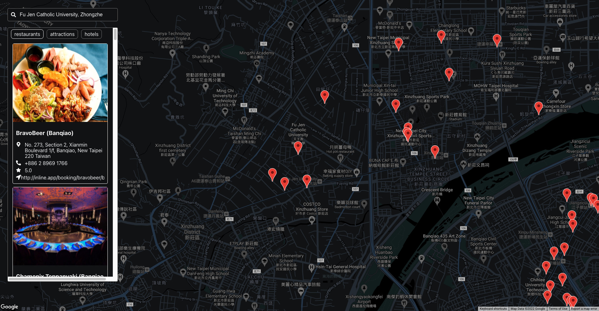

# Travel map (practice) 
> learn by doing :  React.js, Style components, RapidAPI, GoogleMap
---

---
- [link](https://travel-map-rust.vercel.app/) : Demo
---
## Stack 
- [React](https://reactjs.org/) : A JavaScript library for building user interfaces 
- [Styled Components](https://styled-components.com/docs) : Utilising tagged template literals (a recent addition to JavaScript) and the power of CSS, styled-components allows you to write actual CSS code to style your components. It also removes the mapping between components and styles – using components as a low-level styling construct could not be easier!
- [RapidAPI](https://rapidapi.com/hub) : Discover and connect to thousands of APIs

